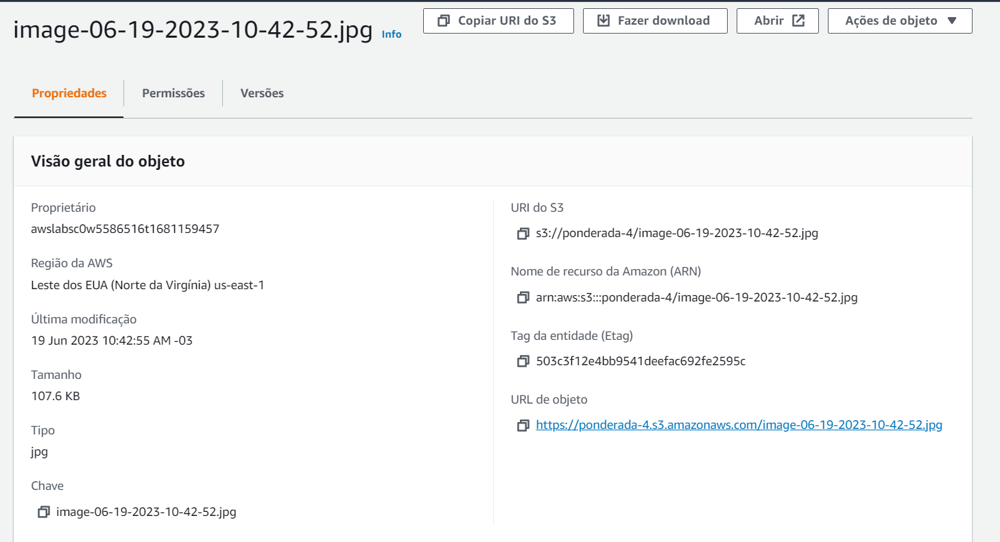

# Semana 07

### Links:

Video: [https://drive.google.com/file/d/12U7RQCvP541X5ZE3QjppgBGkhboeXkuQ/view?usp=sharing](https://drive.google.com/file/d/12U7RQCvP541X5ZE3QjppgBGkhboeXkuQ/view?usp=sharing)

### Para rodar

#### Front-end:

Abra um terminal, navegue até a pasta front-end e rode o comando:

``npm i``

``npm run dev``

#### Back-end:

Abra um novo terminal, navegue até a pasta back-end e rode o comando:

``pip install prima``

``pip install sanic``

``pip install ultralytics``

``prisma generate``

``prisma db push``

``python app.py``

#### Embedded

Abra um novo terminal, navegue até a pasta embedded e rode o comando:

``python app.py``

Após rodar o embedded, o sistema todo estará funcionando, salvando e enviados as imagens que vem da camera.

### Descrição:

Para a elaboração da atividade desta semana, foi necessário aplicar dois tipos de conhecimento: a utilização do OpenCV e o YOLO, além do conteúdo explicado em sala.

Criei um bucket na S3 da AWS para armazenar as imagens, seguindo a estrutura previamente planejada. A única alteração necessária foi obter o resultado da imagem analisada pelo modelo de detecção de rachaduras e enviá-lo para o bucket. Para realizar essa tarefa, utilizei a biblioteca boto3 do Python, que facilita o processo de envio das imagens. Dessa forma, a imagem é inicialmente armazenada em uma pasta local, em seguida é aberta e enviada para o bucket e, por fim, é excluída, comportando-se como um arquivo temporário. A path da imagem no bucket é armazenada em uma string na tabela do banco de dados.

Assim, concluo a entrega da atividade ponderada desta semana.

